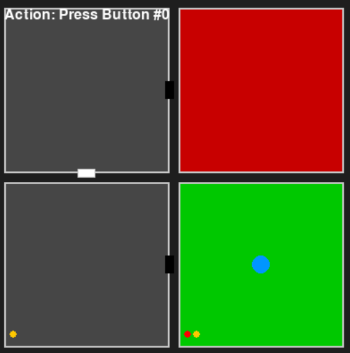

# Riddle-Generator

**Riddle-Generator** is a Python-based tool designed to automatically generate and test labyrinth riddles. It creates complex environments where an agent must navigate rooms, interact with buttons, and manipulate door states to find a path from a start room to a goal room.

## Features
- **Procedural Generation**: Creates random room layouts and puzzles every time.
- **Matrix-Based Logic**: Uses NumPy matrices to efficiently represent the physical world, door states, and interaction logic.
- **Dynamic Action Space**: The available actions change dynamically based on the agent's current room and the state of the environment.
- **Solver Agent**: Includes a random agent to test the generated riddles for solvability.

---

## Installation

Clone the repository and install the package in editable mode:

```bash
git clone https://github.com/bakethi/Riddle-Generator.git
cd Riddle-Generator
python -m venv .venv
source .venv/bin/activate
pip install -e .
```

To run the generator and see the agent attempt to solve a riddle:
```bash
python -m lab_generator.main
```

To run the unit tests:
```bash
pytest
```
---
## How It Works
The core logic of the Riddle-Generator relies on four key matrices to define the environment and a dynamic system for agent interaction.
1. **Lab Generation & Matrices**
The LabGenerator class creates the environment using the following NumPy matrices:

- room_trans_matrix (Physical Layout) Shape: $N \times N$ (Rooms × Rooms)
**Description:** Defines the static physical structure of the labyrinth. A 1 at index [i, j] means there is a doorway connecting Room i and Room j. This matrix is symmetric, ensuring connections go both ways, and the diagonal is set to 1 (rooms connect to themselves).  
<br>
- door_state_matrix (Current Door Status) Shape: $N \times N$
**Description:** Represents the current state of the doors. While the transition matrix defines where doors exist, this matrix defines which ones are currently OPEN (1) or CLOSED (0). The agent can only move through a connection if the corresponding value here is 1.
<br>
- button_location_matrixShape: $N \times M$ (Rooms × Buttons)
**Description:** Maps the location of interaction points. A 1 at [r, b] indicates that Button b is located inside Room r.
<br>
- button2door_behavior_matrix (Interaction Logic)Shape: $M \times N \times N$ (Buttons × Rooms × Rooms)
**Description:** A stack of matrices defining what happens when a button is pressed. For a specific button b, the slice [b, :, :] is a mask. When that button is pressed, the system performs an XOR operation on the door_state_matrix using this mask, effectively toggling the open/closed state of specific doors.

2. **Action Space Generation**
The environment does not use a fixed set of actions (like "North", "South", "East", "West"). Instead, the Environment class generates a dynamic action space at every step based on the agent's current situation.The action space is a list of lists, where the index in the outer list corresponds to the Action Type:

- Action Type 0: Press Button
The environment checks button_location_matrix for the current room.
Subactions: A list of indices for all buttons present in the room.
<br>
- Action Type 1: MoveThe environment checks door_state_matrix for the current room.
Subactions: A list of connected room indices where the door is currently OPEN.
<br>
- Action Type 2: Backtrack
Available only if the agent has moved at least once (last_room is not None).
Subactions: A single command to return to the previous room.
<br>
- Agent Selection:The agent analyzes this dynamic list, filters out empty actions (e.g., if there are no buttons in the room), and randomly selects a valid action and subaction to execute.

3. **Visualization**

The project includes a Pygame-based visualization tool to replay recorded runs that are saved in the history folder. It reads the generated history files to animate the agent's journey through the labyrinth step-by-step.



* **Visuals**: The Agent (Blue) navigates from Start (Green) to Goal (Red).
* **Dynamics**: Watch doors open and close in real-time based on the agent's interactions.
* **Interactions**: Buttons light up (Red) when pressed by the agent to indicate which door mechanisms are being triggered.

-  **How to Run**
The visualization code is currently located on a separate branch. To utilize it:

1. Switch to the visualization branch:
   ```bash
   git checkout Visualization-Example
    ```
2. Install the visualization dependencies (Pygame):
    ```bash
    pip install pygame
    ```
3. Run the visualization script:
    ```bash
    python visualization.py
    ```